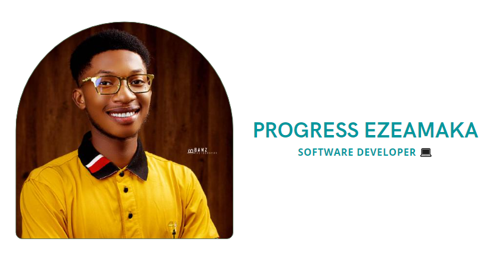

<h1 align="left">Hi 👋, I'm Progress</h1>

  

<h3 align="center">A passionate 💻Software developer from Nigeria</h3>                                                                                                                                              

  

  

- ✨ Interests: coding, swimming, music and eating 😆.
- 🌱 I’m currently learning **Ruby on Rails, React** and working on side projects. 
- 👩‍💻 I’m currently studying and training to become a **Full-Stack Software Developer** in a remote, collaborative and multicultural environment at [Microverse.](https://github.com/microverseinc)

<h3 align="left">Connect with me:</h3>

<h3 align="left">Languages and Tools:</h3>

          

  
   

  
&nbsp;

